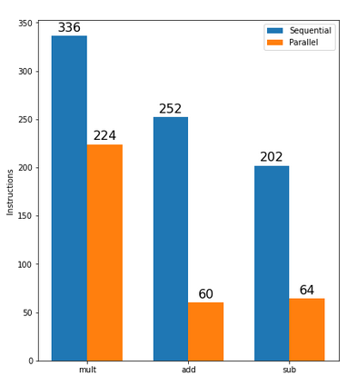

# Residue Number System (RNS) - A faster approach to computing

Théo PETIT, IAA/IMATH - University of Toulon

Summer 2021

## Abstract

Computing is about speed, especially when dealing whith very large number (hundreths of digits). When you can improve hardware to compute faster, playing wih reprentations of those numbers can be a great way to tackle physical barriers. Systems such as RNS are about exploring new number representations to fasten basic compuations (addition and multiplication).
When it comes to protect sensible data, one company need to ensure his encryption system is unbreakable. It usually is addressed by using such large numbers that reversing its algorithm, while the method is konwn and public, would take millions of years with current hardware. Our research is all about shrinking this delay. Researchers are hired by one to find a way to crack their system, in hope they would not achieve it, therefore ensuring no one can.

## General terms

Cryptography, computation, modulo operation.

## Keywords

Hardware limitation, number systems, performance by parallel computing

## Introduction

The Residue Number System (RNS) is an unsusual representaion of large numbers. As an example, let's take the number **six hundred and twenty three**, its common reprentation is **623**, we could also use Roman Numerals **DCXXIII**. As a non-trivial system, RNS is not enough by itself: it needs a base. A base is a group of numbers whith some proporties. An example of base is _(11, 12, 13)_ (as they are pairwise co-prime). The RNS representation is computed using the modulo operation, therefore our example in this base is $(623\ mod\ 11, 623\ mod\ 12, 623\ mod\ 13)$ = **(7, 11, 12)**.
The advantages we found regarding RNS representation begins to show itself: we can reprent large numbers with multiple significally smaller ones. Moreover, with two numbers reprensented using the same base, we are able to use parallel computing, here is an example:
Using the base $(11, 12, 13)$, let's add $623$ and $234$.
Their RNS represntation is $(7, 11, 12)$ and $(3, 6, 0)$.
Therefore, the reprentation of $623 + 234$ is $(7 + 3\ mod\ 11, 11 + 6\ mod\ 12, 12 + 0\ mod\ 13)\ =\ (10, 5, 12)$
And we can check the correcness of the result a it is easy to calculate (due to the small scale of the example): $623 + 234 = 857$. And the representation of $857$ is $(10, 5, 12)$.
What is so great about this method is that the three smaller operations we did are independants, they can be computed in parallel. Instead of storing and computing two large numbers, we would rather store more and compute 6 smaller numbers (storage is not an issue in computer science).

## Implementation

We implemented this computation method in C language, firstly in a sequential way (non-parallel) and then switching to parallel computing. 

## Results and conclusion

As we see on the following figure, the parallel computing aspect of the new algorithm is far better than the sequential one. The parallel version droping by a factor of 4 when computing addition.

## Related work

AMNS (an other number representation) presentation (way more difficult...)

AVX vector usage (mostly intel)

## Implications

Despite this computing method being far better than the usual algorithm, the representation might be a limiting factor. The computing tool we are using is an aspect of Intel's processing unit that is still very limited. As use case for the everyday customer is close to non-existant, it is very unlikely that Intel manufactures better hardware for our algorithm to be efficient. 

## Bibliography

[1] - Residue Number System Wikipedia page -_https://en.wikipedia.org/wiki/Residue_number_system_

[2] - Efficient modular operations using the adapted modular number system - by Laurent-Stéphane Didier, Fangan-Yssouf Dosso & Pascal Véron

[3] - # Efficient Modular Arithmetic in Adapted Modular Number System Using Lagrange Representation - by C. Nègre & Thomas Plantard